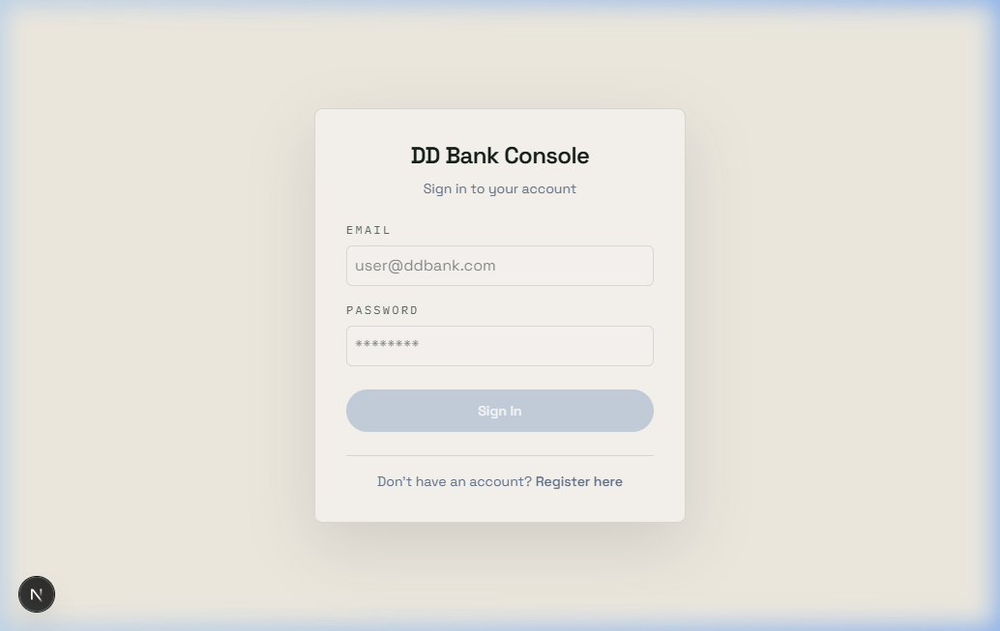
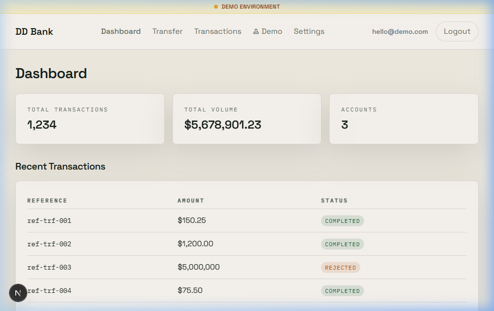
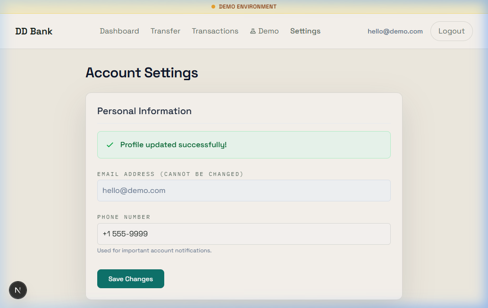

# DD Bank

DD Bank is a mini core banking system built as a polyglot backend project.

End-to-end request flow:

`Client -> Go transaction-service -> Rust fraud-service -> Kotlin ledger-service -> PostgreSQL`

## Overview

This project demonstrates how a transfer request moves through multiple services while preserving banking invariants such as atomicity, idempotency, and double-entry consistency.

Main components:

- `transaction-service` (Go): public HTTP entrypoint for `POST /transfer`, request orchestration, bounded retry, timeout handling, correlation ID propagation, and response normalization.
- `fraud-service` (Rust): fraud decision endpoint `POST /fraud/check`, payload validation, amount-threshold rule, and standardized approve/reject responses.
- `ls_springboot` (Kotlin / Spring Boot): transactional ledger service with idempotent transfer handling, double-entry journal posting, read model endpoints, and PostgreSQL persistence.
- PostgreSQL `ddbank`: stores `accounts`, `ledger_transactions`, and `journal_entries`.

## Architecture Goals

- Keep transfer processing atomic.
- Guarantee `DEBIT == CREDIT` for every successful ledger transaction.
- Make duplicate client retries safe through idempotency.
- Reject suspicious transfers before writing to the ledger.
- Preserve observability across services with correlation IDs.

## Transfer Flow

1. The client sends a request to Go `POST /transfer`.
2. The Go service validates the payload and calls Rust `POST /fraud/check`.
3. If the fraud service rejects the transfer, the flow stops and nothing is written to the ledger.
4. If the fraud service approves the transfer, Go calls Kotlin `POST /ledger/transfer`.
5. The ledger creates one `ledger_transaction` and two `journal_entries` inside a single database transaction.
6. After commit, the ledger emits a `TransactionCompletedEvent`.
7. The final response is returned to the client together with a `correlation_id`.

## Business Guarantees

- Atomic transfer: the transaction record and both journal entries are written inside one `@Transactional` unit.
- Double-entry consistency: total `DEBIT` must always equal total `CREDIT`.
- Idempotency: `reference` is unique and retrying the same request returns the existing transaction with `duplicate=true`.
- Fraud gate: amounts above `1_000_000.00` are rejected before reaching the ledger.
- Observability: all services propagate `X-Correlation-Id`.

## Service Ports

- Ledger service: `8080`
- Transaction service: `8081`
- Fraud service: `8082`

Supported runtime configuration:

- Go: `PORT`, `FRAUD_SERVICE_URL`, `LEDGER_SERVICE_URL`, `HTTP_TIMEOUT_MS`, `HTTP_RETRY_COUNT`
- Rust: `PORT`
- Kotlin: `--server.port=<port>` or standard Spring configuration

## Run Locally

1. Make sure PostgreSQL is running on `localhost:5432`.
2. Create database `ddbank`.
3. Use credentials:
   - user: `postgres`
   - password: `123123`
4. Start the ledger service:

```powershell
cd ls_springboot
$env:GRADLE_USER_HOME=(Join-Path (Get-Location) '.gradle')
.\gradlew.bat bootRun --no-daemon --console=plain
```

5. Start the fraud service:

```powershell
cd fraud-service
cargo run
```

6. Start the transaction service:

```powershell
cd transaction-service
$env:GOCACHE=(Join-Path (Get-Location) '.gocache')
go run ./cmd/main.go
```

## Task Runner

If you already have `task` installed, this is the easiest no-Docker workflow:

```powershell
task test
task db:verify
task smoke
task concurrency
task load
```

Available tasks:

- `task run` or `task run:ledger`: run the Kotlin ledger service.
- `task run:fraud`: run the Rust fraud service.
- `task run:transaction`: run the Go transaction service.
- `task test`: run the full backend test suite.
- `task db:verify`: validate schema, unique transaction reference, and critical foreign keys in PostgreSQL.
- `task smoke`: start the full stack, test a successful transfer, a fraud rejection, and a duplicate retry, then stop the stack.
- `task concurrency`: run an end-to-end duplicate-request race test and verify that only one transaction is persisted.
- `task load`: run a lightweight local load test and report latency plus throughput.

## Demo Accounts

The ledger ensures these demo accounts exist at startup:

- `ACC-001`
- `ACC-002`
- `ACC-003`

## Important Endpoints

- Go:
  - `GET /health`
  - `POST /transfer`
- Rust:
  - `GET /health`
  - `POST /fraud/check`
- Kotlin:
  - `GET /health`
  - `POST /ledger/transfer`
  - `GET /ledger/transactions`

## Example Transfer Request

```json
{
  "reference": "ref-demo-001",
  "from_account": "ACC-001",
  "to_account": "ACC-002",
  "amount": 150.25
}
```

## Verification

The following checks were run successfully in the local environment:

- `task test`
- `task db:verify`
- `task smoke`
- `task concurrency`
- `task load`

Kotlin integration tests cover:

- valid transfer
- duplicate transfer
- rollback on failure
- concurrent duplicate idempotency
- concurrent distinct transfers staying balanced
- database unique-constraint and foreign-key failures

End-to-end smoke validation confirms:

- small transfers succeed through Go -> Rust -> Kotlin -> PostgreSQL
- large transfers are rejected by fraud rules
- `ledger_transactions.reference` is enforced as unique in PostgreSQL

## UI Product Upgrade

The `ui` module has been upgraded from a prototype mock to a full, production-like dashboard:

- **Auth Connect:** Real postgres-backed authentication with bcrypt password hashing via Go `transaction-service`.
- **Protected Routes:** Complete user-session management intercepting unauthenticated requests.
- **UX Hardening:** Prevents double submissions and provides beautiful, animated UI feedback banners.
- **Settings & Demo Support:** Dynamic user profile configuration and presentation-ready demo environment capabilities.

### Screenshots

**Login**


**Dashboard**


**Settings**

